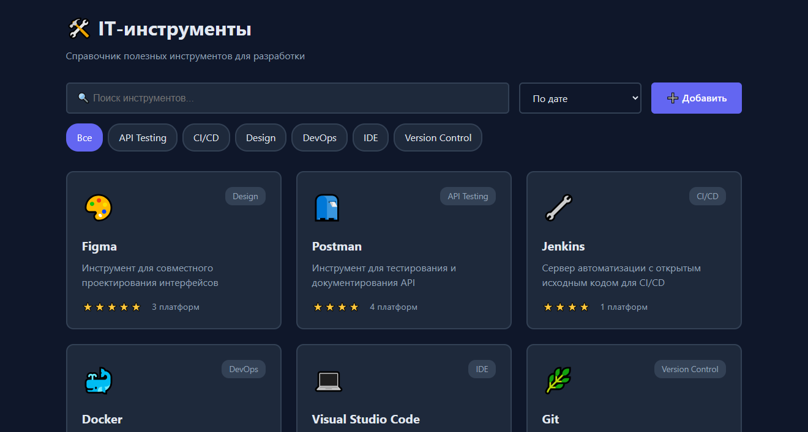
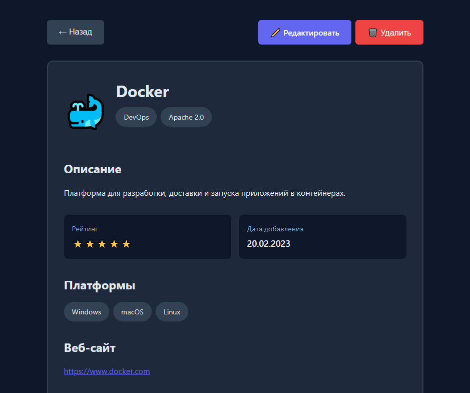
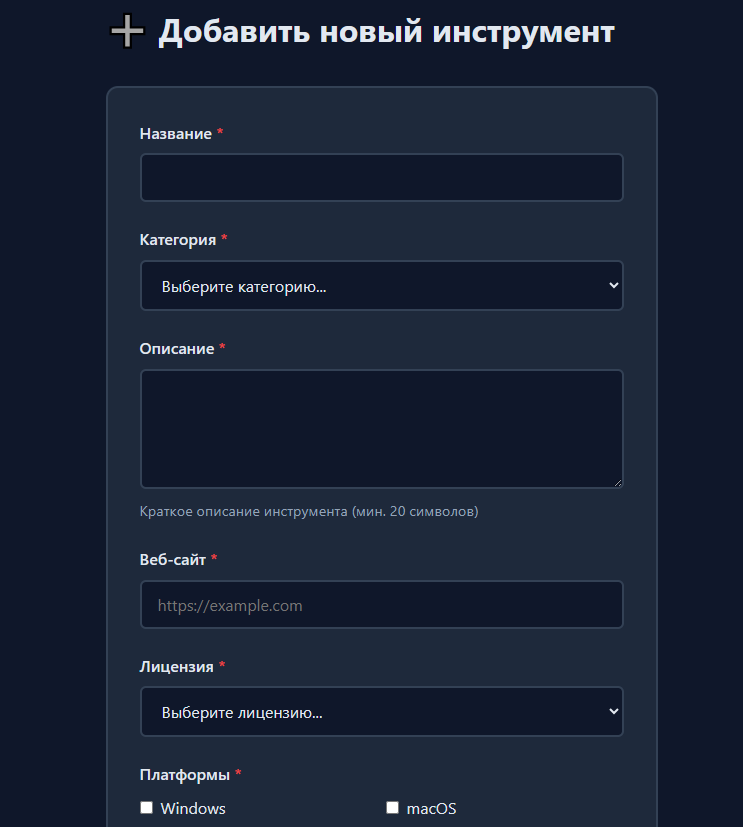
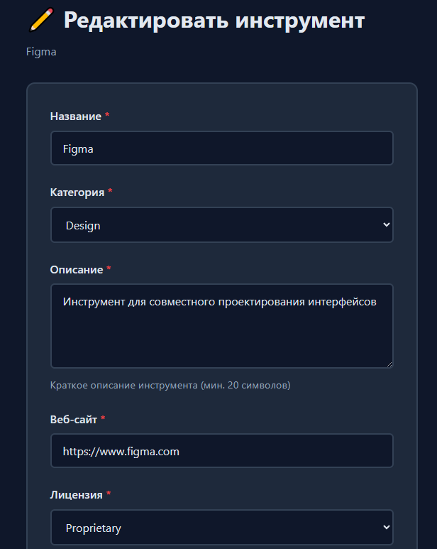
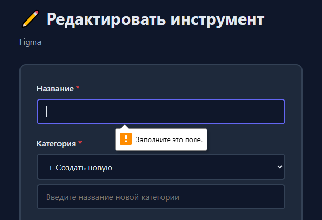
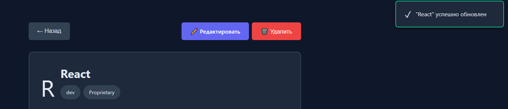
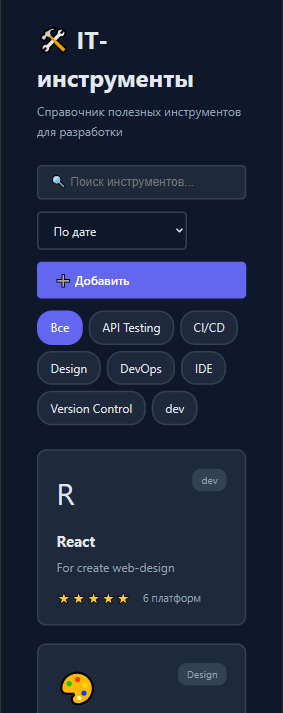
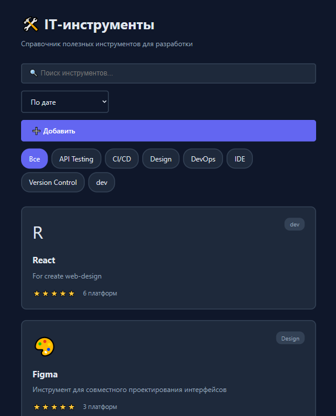

# Лабораторная работа №4: Справочник IT-инструментов

**Студент:** Ярмола Александр  
**Вариант:** 23 - Справочник IT-инструментов  
**Дата:** 2025

## 🌐 Демо

**Ссылка на проект:** [https://alexsandro007.github.io/WT-AC-2025/students/YarmolaAleksandr/task_04/src/index.html](https://alexsandro007.github.io/WT-AC-2025/students/YarmolaAleksandr/task_04/src/index.html)

### Демо-аккаунты для входа:
- 👨‍💼 **Admin**: `admin / admin123`
- 👤 **User**: `user / user123`

## 📋 Содержание

1. [Описание проекта](#описание-проекта)
2. [Технологии](#технологии)
3. [Архитектура](#архитектура)
4. [Маршрутизация](#маршрутизация)
5. [API](#api)
6. [Компоненты](#компоненты)
7. [Views](#views)
8. [Функциональность](#функциональность)
9. [Запуск проекта](#запуск-проекта)
10. [Скриншоты](#скриншоты)
11. [Выполнение требований](#выполнение-требований)

## Описание проекта

SPA-приложение для управления справочником IT-инструментов с полным CRUD функционалом, хеш-роутингом и валидацией форм.

### Основные возможности:
- ✅ Просмотр списка IT-инструментов с поиском и фильтрацией
- ✅ Детальная информация об инструменте
- ✅ Создание новых инструментов
- ✅ Редактирование существующих инструментов
- ✅ Удаление инструментов
- ✅ Валидация форм
- ✅ Toast уведомления
- ✅ Адаптивный дизайн

## Архитектура

```
task_04/
├── src/
│   ├── index.html          # Главная страница
│   ├── styles.css          # Глобальные стили
│   └── js/
│       ├── app.js          # Главный файл приложения
│       ├── router.js       # Хеш-роутер
│       ├── api.js          # API клиент (localStorage)
│       ├── components/     # UI компоненты
│       │   ├── Loading.js
│       │   ├── Error.js
│       │   ├── Empty.js
│       │   └── Toast.js
│       └── views/          # Представления страниц
│           ├── ListView.js
│           ├── DetailView.js
│           ├── CreateView.js
│           └── EditView.js
└── doc/
    ├── README.md           # Документация
    └── screenshots/        # Скриншоты
```

## Маршрутизация

### Router (`router.js`)

Класс `Router` реализует хеш-роутинг с поддержкой параметров:

```javascript
// Регистрация маршрутов
router.addRoute('/', handler);
router.addRoute('/items/:id', handler);
router.addRoute('/new', handler);
router.addRoute('/items/:id/edit', handler);

// Навигация
router.navigate('/items/1');
router.back();
```

### Маршруты приложения:

| Маршрут | Описание | View |
|---------|----------|------|
| `#/` | Список всех инструментов | ListView |
| `#/items/:id` | Детальная информация | DetailView |
| `#/new` | Создание инструмента | CreateView |
| `#/items/:id/edit` | Редактирование | EditView |

### Реализация:

```javascript
pathToRegex(path) {
    const pattern = path
        .replace(/\//g, '\\/')
        .replace(/:(\w+)/g, '(?<$1>[^/]+)');
    return new RegExp(`^${pattern}$`);
}
```

Преобразует `/items/:id` в regex с именованными группами для извлечения параметров.

## API

### ToolsAPI (`api.js`)

API клиент для работы с данными через localStorage:

#### Методы:

**GET - Получение списка**
```javascript
await api.getAll({ 
    search: 'vscode',      // Поиск по названию/описанию
    category: 'IDE',       // Фильтр по категории
    sort: 'rating'         // Сортировка (name, rating, date)
});
```

**GET - Получение по ID**
```javascript
await api.getById(1);
// Возвращает объект инструмента или выбрасывает ошибку
```

**POST - Создание**
```javascript
await api.create({
    name: 'Visual Studio Code',
    category: 'IDE',
    description: 'Мощный редактор кода...',
    website: 'https://code.visualstudio.com',
    license: 'MIT',
    platforms: ['Windows', 'macOS', 'Linux'],
    icon: '💻',
    rating: 5
});
```

**PUT - Обновление**
```javascript
await api.update(1, {
    name: 'VS Code',
    rating: 5
});
```

**DELETE - Удаление**
```javascript
await api.delete(1);
```

**Дополнительно**
```javascript
await api.getCategories();
// Возвращает список уникальных категорий
```

### Эмуляция сети

Все методы имеют задержку 500мс для реалистичной эмуляции сетевых запросов:

```javascript
function delay() {
    return new Promise(resolve => setTimeout(resolve, 500));
}
```

## Компоненты

### Loading (`Loading.js`)
Отображает спиннер загрузки:
```javascript
Loading.render('Загрузка данных...');
```

### Error (`Error.js`)
Отображает ошибку с возможностью повтора:
```javascript
ErrorComponent.render('Ошибка загрузки', retryCallback);
```

### Empty (`Empty.js`)
Отображает пустое состояние:
```javascript
Empty.render(
    'Ничего не найдено',
    'Попробуйте изменить фильтры',
    'Добавить',
    '#/new'
);
```

### Toast (`Toast.js`)
Система уведомлений:
```javascript
Toast.success('Успешно сохранено');
Toast.error('Ошибка при удалении');
Toast.warning('Заполните все поля');
```

## Views

### ListView

**Функции:**
- Отображение списка инструментов в виде карточек
- Поиск в реальном времени (debounce 300мс)
- Фильтрация по категориям
- Сортировка (по названию, рейтингу, дате)

**Карточка инструмента:**
```javascript
getToolCard(tool) {
    return `
        <div class="card">
            <div class="card-icon">${tool.icon}</div>
            <div class="card-category">${tool.category}</div>
            <h3>${tool.name}</h3>
            <p>${tool.description}</p>
            <div class="card-meta">
                <span>${'⭐'.repeat(tool.rating)}</span>
                <span>${tool.platforms.length} платформ</span>
            </div>
        </div>
    `;
}
```

### DetailView

**Функции:**
- Детальная информация об инструменте
- Кнопки редактирования и удаления
- Подтверждение удаления через `confirm()`
- Отображение всех полей (рейтинг, платформы, лицензия, веб-сайт)

### CreateView

**Функции:**
- Форма создания нового инструмента
- Валидация полей:
  - Название: минимум 2 символа
  - Описание: минимум 20 символов
  - URL: валидация протокола
  - Категория: выбор или создание новой
  - Платформы: минимум 1 платформа
  - Иконка: максимум 2 символа (эмодзи)
- Отображение ошибок inline
- Range input для рейтинга с визуальным отображением

**Валидация:**
```javascript
validateData(data) {
    const errors = {};
    
    if (!data.name || data.name.trim().length < 2) {
        errors.name = 'Название должно содержать минимум 2 символа';
    }
    
    if (!data.description || data.description.trim().length < 20) {
        errors.description = 'Описание должно содержать минимум 20 символов';
    }
    
    // ... другие проверки
    
    return errors;
}
```

### EditView

**Функции:**
- Форма редактирования (переиспользует логику CreateView)
- Предзаполнение полей текущими значениями
- Та же валидация
- Сохранение изменений через API

## Функциональность

### 1. CRUD операции

**CREATE**
- Форма с валидацией
- Создание новых категорий
- Toast уведомление об успехе
- Редирект на главную после создания

**READ**
- Список с поиском и фильтрацией
- Детальная страница с полной информацией
- Loading состояние при загрузке

**UPDATE**
- Форма редактирования
- Сохранение ID и даты создания
- Toast уведомление об успехе
- Редирект на детальную страницу

**DELETE**
- Подтверждение через modal
- Toast уведомление об успехе
- Редирект на главную

### 2. Поиск и фильтрация

**Поиск:**
- Поиск по названию и описанию
- Case-insensitive
- Debounce 300мс для оптимизации
- Очистка фильтра при переходе

**Фильтры:**
- По категориям (динамический список)
- Кнопка "Все" для сброса
- Визуальное выделение активного фильтра

**Сортировка:**
- По названию (алфавитный порядок)
- По рейтингу (от высокого к низкому)
- По дате (от новых к старым)

### 3. Валидация форм

**Поля с валидацией:**
- Название (required, min 2 символа)
- Категория (required, select или custom)
- Описание (required, min 20 символов, textarea)
- Веб-сайт (required, URL валидация)
- Лицензия (required, select)
- Платформы (required, min 1, checkbox group)
- Иконка (required, max 2 символа)
- Рейтинг (required, range 1-5)

**Отображение ошибок:**
```javascript
showErrors(errors) {
    Object.keys(errors).forEach(field => {
        const errorEl = document.getElementById(`${field}Error`);
        const inputEl = document.getElementById(field);
        
        errorEl.textContent = errors[field];
        inputEl.style.borderColor = 'var(--danger)';
    });
}
```

### 4. UI/UX

**Loading состояния:**
- Spinner при загрузке данных
- Текстовое сообщение
- Disabled кнопки во время submit

**Error состояния:**
- Иконка ошибки
- Понятное сообщение
- Кнопка "Попробовать снова"

**Empty состояния:**
- Иконка пустого списка
- Информативное сообщение
- Призыв к действию

**Toast уведомления:**
- Success (зеленый, 3 секунды)
- Error (красный, 5 секунд)
- Warning (желтый, 4 секунды)
- Анимация появления/исчезновения

## Запуск проекта

### Вариант 1: Python HTTP Server
```bash
cd task_04/src
python -m http.server 8004
```
Открыть: http://localhost:8004

### Вариант 2: Live Server (VS Code)
1. Установить расширение "Live Server"
2. Открыть `task_04/src/index.html`
3. ПКМ → "Open with Live Server"

### Вариант 3: Любой веб-сервер
Просто откройте `task_04/src/index.html` через любой статический сервер.

## Скриншоты

### 1. Главная страница - Список инструментов


*Отображение списка инструментов с поиском, фильтрацией и сортировкой*

### 2. Детальная страница


*Полная информация об инструменте с кнопками редактирования и удаления*

### 3. Создание инструмента


*Форма создания с валидацией всех полей*

### 4. Редактирование


*Форма редактирования с предзаполненными полями*

### 5. Валидация формы


*Отображение ошибок валидации inline*

### 6. Toast уведомления


*Система уведомлений о действиях пользователя*

### 7. Адаптивный дизайн




*Адаптивный дизайн для мобильных устройств и планшетов*

## Выполнение требований

### Обязательные требования (100 баллов)

| № | Требование | Баллы | Выполнение | Реализация |
|---|------------|-------|------------|------------|
| 1 | SPA с хеш-роутингом | 20 | ✅ | `router.js` - класс Router с поддержкой параметров |
| 2 | Минимум 4 маршрута | 10 | ✅ | `/`, `/items/:id`, `/new`, `/items/:id/edit` |
| 3 | GET список элементов | 10 | ✅ | `api.getAll()` с фильтрацией и сортировкой |
| 4 | GET элемент по ID | 10 | ✅ | `api.getById(id)` с обработкой ошибок |
| 5 | POST создание элемента | 15 | ✅ | `api.create(data)` с валидацией |
| 6 | PUT/PATCH обновление | 15 | ✅ | `api.update(id, data)` |
| 7 | DELETE удаление | 10 | ✅ | `api.delete(id)` с подтверждением |
| 8 | Валидация форм | 10 | ✅ | `validateData()` с 8 правилами валидации |

### Бонусы из методички (+10 баллов)

| № | Бонус | Баллы | Выполнение | Реализация |
|---|-------|-------|------------|------------|
| 1 | **Сохранение параметров в hash** | +3 | ✅ | `parseFiltersFromURL()` + `updateURL()` |
| 2 | **Предзагрузка данных (prefetch)** | +3 | ✅ | `prefetchTool()` при hover/focus |
| 3 | **Клиентская авторизация** | +4 | ✅ | JWT-токены + защита маршрутов |

#### Детали бонусных функций:

**1. Сохранение параметров поиска в hash (+3 балла)**

При изменении фильтров URL автоматически обновляется:
- `#/?search=docker` - поиск
- `#/?category=IDE&sort=rating` - категория + сортировка  
- `#/?search=code&category=IDE&sort=rating` - все вместе

При перезагрузке страницы фильтры восстанавливаются из URL:

```javascript
parseFiltersFromURL() {
    const hash = window.location.hash.slice(1);
    const [path, query] = hash.split('?');
    
    if (query) {
        const params = new URLSearchParams(query);
        this.filters.search = params.get('search') || '';
        this.filters.category = params.get('category') || 'all';
        this.filters.sort = params.get('sort') || 'name';
    }
}

updateURL() {
    const params = new URLSearchParams();
    if (this.filters.search) params.set('search', this.filters.search);
    if (this.filters.category !== 'all') params.set('category', this.filters.category);
    if (this.filters.sort !== 'name') params.set('sort', this.filters.sort);
    
    const newHash = params.toString() ? `/?${params.toString()}` : '/';
    window.history.replaceState(null, '', `#${newHash}`);
}
```

**2. Предзагрузка данных (prefetch) (+3 балла)**

При наведении/фокусе на карточку инструмента данные загружаются в фоне:

```javascript
// Кэш для предзагруженных данных
this.prefetchCache = new Map();

async prefetchTool(toolId) {
    if (this.prefetchCache.has(toolId)) return;
    
    this.prefetchCache.set(toolId, 'loading');
    const data = await this.api.getById(toolId);
    this.prefetchCache.set(toolId, data);
    
    console.log(`✅ Предзагружены данные для инструмента #${toolId}`);
}

// Привязка к событиям
card.addEventListener('mouseenter', () => this.prefetchTool(toolId));
card.addEventListener('focus', () => this.prefetchTool(toolId));
```

**3. Клиентская авторизация (+4 балла)**

Система авторизации с JWT-токенами:
- Форма входа с демо-аккаунтами (admin/admin123, user/user123)
- Генерация JWT-токенов при входе
- Добавление токена в Authorization header для всех запросов
- Защита маршрутов `/new` и `/edit` (редирект на `/login`)
- Кнопки "Войти"/"Выйти" в navbar с отображением пользователя
- Регистрация новых пользователей

Все запросы логируются в консоль с headers для демонстрации работы токенов.

## Выводы

### Что реализовано:

1. ✅ **Полноценный SPA** с хеш-роутингом и параметрами
2. ✅ **CRUD операции** через localStorage API
3. ✅ **Модульная архитектура** (Router, API, Views, Components, Auth)
4. ✅ **Валидация форм** с inline отображением ошибок
5. ✅ **Поиск и фильтрация** в реальном времени с сохранением в URL
6. ✅ **Loading/Error/Empty** состояния
7. ✅ **Toast уведомления** для обратной связи
8. ✅ **Адаптивный дизайн** для мобильных устройств
9. ✅ **Анимации** для улучшения UX
10. ✅ **Prefetch** - предзагрузка данных при hover/focus
11. ✅ **Авторизация** - JWT-токены с защитой маршрутов

### Технические решения:

1. **Роутинг:** Regex с именованными группами для параметров + защита маршрутов
2. **API:** localStorage с эмуляцией задержки сети + Authorization headers
3. **Валидация:** Централизованная с отображением ошибок
4. **Авторизация:** JWT-токены в localStorage + middleware
5. **URL:** Сохранение параметров поиска в hash с восстановлением
6. **Prefetch:** Предзагрузка данных с кэшированием
7. **Состояния:** Отдельные компоненты для переиспользования
8. **События:** Debounce для оптимизации поиска
